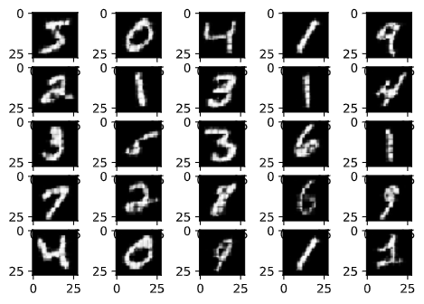
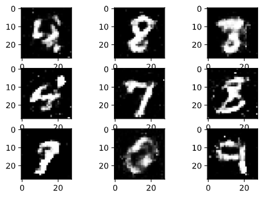
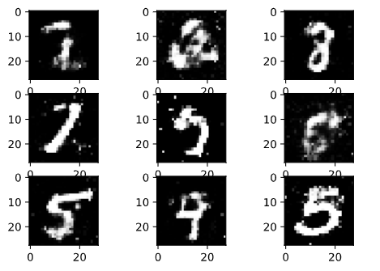

# Deep Gemerative Network Practices

Here is a practice project, I realized several NNs using pytorch:
+ Full-connected neural network with hand-crafted backpropagation implemented with only NumPy
+ Full-connected neural network implemented by pytorch
+ CNN based neural network
+ CNN and transposed CNN based autoencoder generator
+ Full-connected GAN based on the [original GAN paper](https://arxiv.org/abs/1406.2661)
+ CNN and transposed CNN based GAN based on [DCGAN](https://arxiv.org/pdf/1511.06434.pdf)

### Image generated by Autoencoder

### Image generated by GAN

## You can see a more advanced project [here](https://github.com/GrayardET/ML-Projects-with-Mark-Vogelsberger)
